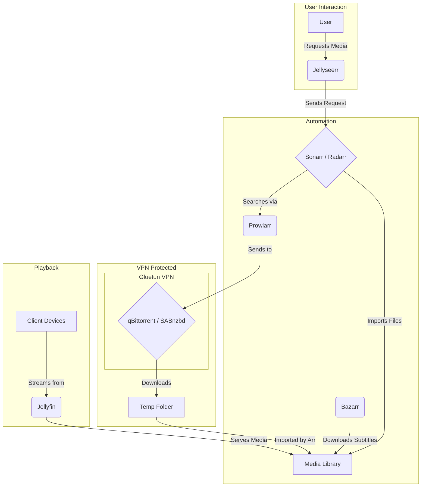

# 🌌 KryNet Homelab: Production-Grade Private Cloud

**Architected for Resilience | Powered by ZFS | Secured by Zero Trust**

<p align="center">
  
  
  
  
</p>

A production-grade private cloud ecosystem serving a family of four. This repository documents the complete hardware, software, and networking architecture of a self-hosted infrastructure that rivals commercial cloud services while maintaining complete data sovereignty.

---

## 🗺️ Quick Navigation

| Document | Description |
|----------|-------------|
| [**📖 README**](#-table-of-contents) | This file - Project overview |
| [**🔥 Agni Server**](docs/AGNI-SERVER.md) | Network Core documentation |
| [**🌟 Prime Server**](docs/PRIME-SERVER.md) | Storage & Media Hub documentation |
| [**🌐 Networking**](docs/NETWORKING-QUICKREF.md) | Quick networking reference |

---

## 📋 Table of Contents

1. [Philosophy & Design Principles](#-philosophy--design-principles)
2. [Architecture Overview](#-architecture-overview)
3. [Hardware Infrastructure](#-hardware-infrastructure)
4. [Storage Architecture](#-storage-architecture)
5. [Networking Stack](#-networking-stack)
6. [Service Ecosystem](#-service-ecosystem)
7. [Security Implementation](#-security-implementation)
8. [Data Integrity & Maintenance](#-data-integrity--maintenance)
9. [Backup & Resilience](#-backup--resilience)
10. [Monitoring & Operations](#-monitoring--operations)
11. [Getting Started](#-getting-started)
12. [Directory Structure](#-directory-structure)
13. [Future Roadmap](#-future-roadmap)

---

## 🎯 Philosophy & Design Principles

This homelab operates under the **"Home Utility"** model — when the system is down, the house is "broken."

### Core Pillars

| Principle | Implementation |
|-----------|----------------|
| **Digital Sovereignty** | 100% data ownership, no vendor lock-in, successful migration from Google Photos |
| **WAF (Wife Approval Factor)** | Services must match "Big Tech" reliability and UX |
| **Zero Trust Architecture** | No open ports, identity-based access via OAuth 2.0 |
| **Production Standards** | Infrastructure-as-Code, automated monitoring, quarterly backup tests |
| **Graceful Degradation** | Multiple redundant paths for all services |

---

## 🏗️ Architecture Overview

```
┌──────────────────────────────────────────────────────────────────────────┐
│                              INTERNET                                     │
└─────────────────────────────────┬────────────────────────────────────────┘
                                  │
           ┌──────────────────────┼──────────────────────┐
           │                      │                      │
    ┌──────▼──────┐        ┌──────▼──────┐       ┌──────▼──────┐
    │ Cloudflare  │        │  Tailscale  │       │   Direct    │
    │   Tunnel    │        │  Mesh VPN   │       │    LAN      │
    │ (Public)    │        │ (Admin)     │       │ (Home)      │
    └──────┬──────┘        └──────┬──────┘       └──────┬──────┘
           │                      │                      │
           └──────────────────────┼──────────────────────┘
                                  │
                    ╔═════════════▼═════════════╗
                    ║     🔥 AGNI SERVER        ║
                    ║  (Network Core - Mini PC) ║
                    ║                           ║
                    ║  • Caddy Reverse Proxy    ║
                    ║  • Cloudflared Tunnel     ║
                    ║  • AdGuard DNS (Primary)  ║
                    ║  • AdGuard Home Sync      ║
                    ║  • Tailscale VPN          ║
                    ║  • Prometheus + Grafana   ║
                    ║  • Home Assistant         ║
                    ╚═════════════╦═════════════╝
                                  ║
                    ╔═════════════▼═════════════╗
                    ║     🌟 PRIME SERVER       ║
                    ║     (Storage Hub)         ║
                    ║                           ║
                    ║  • TrueNAS SCALE          ║
                    ║  • 12TB Raw ZFS (Mirror)  ║
                    ║  • Jellyfin + *Arr Stack  ║
                    ║  • Immich Photos          ║
                    ║  • AdGuard DNS (Secondary)║
                    ║  • GPU Transcoding        ║
                    ╚═══════════════════════════╝
```

---

## 🖥️ Hardware Infrastructure

### Server Fleet

| Server | Hardware | OS | Role |
|--------|----------|----|------|
| **🌟 Prime** | i3-10th Gen F, 32GB DDR4, GTX 1060 3GB | TrueNAS SCALE | Storage Hub |
| **🔥 Agni** | SkullSaints Mini PC, 16GB DDR5, 512GB NVMe | Ubuntu 24.04 | Network Core |

### Prime Server Specs

| Component | Specification |
|-----------|---------------|
| **Chassis** | Old MSI Cabinet (repurposed) |
| **CPU** | Intel Core i3-10th Gen F Series |
| **RAM** | 32GB DDR4 @ 2400 MHz (ZFS ARC + containers) |
| **GPU** | NVIDIA GTX 1060 3GB (NVENC + Immich ML) |
| **Storage** | 12TB raw across 2 ZFS mirror pools (~6TB usable) |
| **OS** | TrueNAS SCALE (Dragonfish 24.10) |
| **Network** | 1Gbps Ethernet |
| **IP Address** | 192.168.1.100 (Static) |

### Agni Server Specs

| Component | Specification |
|-----------|---------------|
| **Device** | SkullSaints Agni Mini PC |
| **RAM** | 16GB DDR5 |
| **Storage** | 512GB NVMe SSD |
| **OS** | Ubuntu Server 24.04 LTS |
| **Network** | 1Gbps Ethernet |
| **IP Address** | 192.168.1.200 (Static) |
| **Power** | ~20W |

---

## 💾 Storage Architecture

All storage is managed via **TrueNAS SCALE** on Prime with ZFS data integrity. Both ZFS pools reside on Prime.

### Storage Pools

| Pool | Hardware | Type | Raw Capacity | Usable Capacity | Purpose |
|------|----------|------|-------------|-----------------|---------|
| **andromeda** | 2× 4TB WD Red Plus | Mirror | 8TB | ~4TB | Immich photos/videos, podcasts, audiobooks |
| **orion** | 2× 2TB WD Blue HDD | Mirror | 4TB | ~2TB | App configs, databases, media library (Movies, TV Series) |

### Data Layout

```
/mnt/orion/
├── apps-config/               # All Docker container configurations
│   ├── adguardhome/           # AdGuard Home (Secondary)
│   ├── jellyfin/              # Media server config
│   ├── sonarr/                # TV automation config
│   ├── radarr/                # Movie automation config
│   ├── prowlarr/              # Indexer config
│   ├── bazarr/                # Subtitle config
│   ├── qbittorrent/           # Torrent client config
│   ├── sabnzbd/               # Usenet client config
│   ├── tdarr/                 # Transcode engine config
│   ├── gluetun/               # VPN gateway config
│   ├── homarr/                # Dashboard config
│   ├── tailscale/             # VPN state
│   ├── rclone/                # Backup config
│   └── ... (30+ services)
│
└── data/
    └── media/                 # Media pipeline library
        ├── movies/            # Movie files (managed by Radarr)
        ├── series/            # TV series (managed by Sonarr)
        ├── anime/             # Anime series
        └── documentaries/     # Documentaries

/mnt/andromeda/
├── apps/
│   └── immich/                # Photo management platform
│       ├── uploads/           # Original photos & videos (500GB+)
│       │   ├── library/       # Per-user photo libraries
│       │   ├── thumbs/        # Generated thumbnails
│       │   └── encoded-video/ # Transcoded videos
│       ├── ml/                # ML model cache (~10GB)
│       │   ├── facial-recognition/
│       │   └── clip/
│       └── db/                # PostgreSQL data (~5GB)
│
└── media/
    ├── podcasts/              # Podcast library (Audiobookshelf)
    └── audiobooks/            # Audiobook library (Audiobookshelf)
```

### ZFS Features

- ✅ **Automatic checksums** on every read
- ✅ **Self-healing** from mirror copies (both pools are mirrored)
- ✅ **Snapshots** for point-in-time recovery
- ✅ **LZ4 compression** (~15% space savings)
- ✅ **Weekly scrubs** for data integrity (Sundays at 23:00)

---

## 🌐 Networking Stack

### Multi-Path Architecture

```
Same URL → Different Paths Based on Location
━━━━━━━━━━━━━━━━━━━━━━━━━━━━━━━━━━━━━━━━━━━

📍 At Home (LAN)
   photos.example.com → AdGuard DNS → Local IP → Caddy → Immich
   Speed: 1Gbps | Latency: <1ms

🌍 Remote (Internet)
   photos.example.com → Cloudflare → Tunnel → Agni → Caddy → Immich
   Speed: Upload limited | Auth: OAuth

🔐 VPN (Tailscale)
   photos.internal.home → Tailscale → Direct P2P → Caddy → Immich
   Speed: P2P optimized | Encryption: WireGuard
```

### Key Components

| Component | Purpose | Server |
|-----------|---------|--------|
| **Caddy** | Reverse proxy with auto-HTTPS | Agni |
| **Cloudflared** | Secure tunnel to Cloudflare | Agni |
| **AdGuard Home** | DNS + ad blocking (Primary on Agni, Secondary on Prime) | Both (synced via AdGuard Sync on Agni) |
| **Tailscale** | Mesh VPN | Both |

### Why Caddy Over Traefik?

1. **Nginx Proxy Manager** → Retired (lack of automation)
2. **Traefik v3** → Replaced (label complexity)
3. **Caddy v2** → Current (simplicity + power)

**Benefits:**
- Centralized Caddyfile (Infrastructure-as-Code)
- Native Cloudflare DNS-01 challenge
- 3 lines config vs 15+ Traefik labels
- Automatic HTTPS with zero configuration

---

## 🎬 Service Ecosystem

**40+ Docker containers** deployed via Portainer Stacks.

### Media Stack



| Service | Purpose | Access |
|---------|---------|--------|
| **Jellyfin** | Media streaming (hardware transcoding) | Public |
| **Jellyseerr** | User media requests | Public |
| **Sonarr/Radarr** | TV/Movie automation | Admin only |
| **Prowlarr** | Indexer management | Admin only |
| **Bazarr** | Subtitle management | Admin only |
| **qBittorrent** | Torrent client (VPN protected) | Admin only |
| **Tdarr** | GPU transcoding to HEVC (~40% savings) | Admin only |
| **Audiobookshelf** | Podcasts and audiobooks | Public |

### Photo Management

| Service | Purpose | Access |
|---------|---------|--------|
| **Immich** | Google Photos replacement | Public (OAuth) |

**Features:**
- GPU facial recognition (via GTX 1060)
- Natural language search ("beach photos")
- 500GB+ migrated from Google Photos
- Full photo/video library stored on **andromeda** pool

### Monitoring & Infrastructure

| Service | Purpose |
|---------|---------|
| **Prometheus** | Metrics collection |
| **Grafana** | Visualization dashboards |
| **Gatus** | Status page |
| **Gotify** | Push notifications |
| **Healthchecks** | Backup monitoring |
| **Dozzle** | Container logs |
| **Homepage** | Dashboard |
| **Home Assistant** | Smart home automation |

---

## 🔒 Security Implementation

### Zero Trust Layers

```
Layer 1: Network
└─ No open ports on router
└─ All traffic via encrypted tunnels

Layer 2: Authentication
└─ Cloudflare Access (Google OAuth)
└─ Only whitelisted family emails

Layer 3: Container Isolation
└─ Separate Docker networks
└─ Minimal privileged containers

Layer 4: VPN Kill Switch
└─ Gluetun blocks non-VPN traffic
└─ Download clients protected
```

### Network Isolation

| Network | Purpose | Containers |
|---------|---------|------------|
| `kry_net` | Internal communication | All backend |
| `traefik_proxy` | Web-exposed only | Caddy-facing |
| `host` | System access | Tailscale, HA, AdGuard |

---

## 🔍 Data Integrity & Maintenance

TrueNAS SCALE on Prime runs automated data integrity tasks for both ZFS pools.

### ZFS Scrub Schedule

Scrubs verify every block of data against its checksum and repair any corruption from mirror copies.

| Pool | Schedule | Time |
|------|----------|------|
| **orion** | Weekly (Sundays) | 23:00 |
| **andromeda** | Weekly (Sundays) | 23:00 |

### ZFS Snapshot Strategy

Periodic snapshots are configured for `orion/apps-config` to protect container configuration data:

| Frequency | Schedule | Retention |
|-----------|----------|-----------|
| Hourly | Every hour, each day | 3 days |
| Daily | 12:00 AM every day | 2 weeks |

### SMART Disk Tests

Automatic SMART tests monitor disk health for early failure detection:

| Test Type | Scope | Schedule | Time |
|-----------|-------|----------|------|
| **Long Test** | Orion disks | 1st of every month | 04:00 AM |
| **Long Test** | Andromeda disks | 1st of every month | 03:00 AM |
| **Short Test** | All disks (Orion + Andromeda) | Weekly | 12:00 AM |

---

## 🔄 Backup & Resilience

### RClone Cloud Backups

All critical configuration and database data is backed up to the cloud via RClone:

| Source | Server | Destination | Purpose |
|--------|--------|-------------|---------|
| `/mnt/orion/apps-config` | Prime | pCloud | All Docker container configs |
| Immich DB backup (from andromeda) | Prime | pCloud | Immich PostgreSQL database backup |
| Agni Docker configs | Agni | pCloud | Agni container configs |

All RClone jobs ping **Healthchecks** on success/failure for dead-man's-switch monitoring.

### Redundancy

| Component | Failure Mode | Fallback |
|-----------|--------------|----------|
| DNS | Agni (primary) down | Prime secondary DNS takes over |
| DNS | Prime (secondary) down | Agni primary continues |
| Reverse Proxy | Agni down | N/A (planned) |
| VPN | Prime down | Agni subnet routing |
| Monitoring | Agni down | N/A (single point) |

---

## 📊 Monitoring & Operations

### Health Monitoring

| Service | Purpose | Alerts |
|---------|---------|--------|
| **Gatus** | HTTP health checks | Service down |
| **Healthchecks** | Dead man's switch | Backup failures |
| **Prometheus** | Metrics collection | Threshold alerts |
| **Grafana** | Visualization | Dashboard |

### Automated Maintenance Summary

| Task | Schedule | Details |
|------|----------|---------|
| 🔄 **RClone Backups** | Periodic | Configs from both servers + Immich DB to cloud |
| 🧹 **ZFS Scrubs** | Weekly (Sundays 23:00) | Both orion & andromeda pools |
| 📸 **ZFS Snapshots (Hourly)** | Every hour | `orion/apps-config`, kept 3 days |
| 📸 **ZFS Snapshots (Daily)** | 12:00 AM daily | `orion/apps-config`, kept 2 weeks |
| 🩺 **SMART Long Test (Orion)** | 1st of month, 04:00 AM | Full disk health scan |
| 🩺 **SMART Long Test (Andromeda)** | 1st of month, 03:00 AM | Full disk health scan |
| 🩺 **SMART Short Test (All)** | Weekly, 12:00 AM | Quick health check all disks |
| 📊 **Speedtest** | Hourly | ISP monitoring |
| ❤️ **Health Pings** | Every 5 minutes | Service uptime checks |

---

## 🚀 Getting Started

### Prerequisites

- Docker & Docker Compose
- Domain with Cloudflare DNS
- Tailscale account
- Cloud storage account (for backups)

### Quick Setup

1. **Clone this repository:**
   ```bash
   git clone https://github.com/yourusername/homelab.git
   cd homelab
   ```

2. **Configure environment:**
   ```bash
   cp stacks/agni/.env.example stacks/agni/.env
   cp stacks/prime/.env.example stacks/prime/.env
   # Edit with your credentials
   ```

3. **Deploy stacks:**
   ```bash
   cd stacks/agni
   docker compose -f caddy-stack.yml up -d
   docker compose -f cloudflared-stack.yml up -d
   # ... continue with other stacks
   ```

4. **Configure Cloudflare Tunnel:**
   - Create tunnel in Zero Trust dashboard
   - Add token to `CF_TOKEN` env variable
   - Configure public hostnames

5. **Setup AdGuard DNS rewrites:**
   - Add split-horizon rules
   - Point router DHCP to AdGuard IPs (Agni primary: 192.168.1.200, Prime secondary: 192.168.1.100)

---

## 📁 Directory Structure

```
homelab/
├── README.md                   # This file
├── docs/
│   ├── AGNI-SERVER.md         # Agni documentation
│   ├── PRIME-SERVER.md        # Prime documentation
│   ├── NETWORKING-QUICKREF.md # Quick networking reference
│   └── INDEX.md               # Documentation index
├── stacks/
│   ├── agni/                  # Agni Docker stacks
│   │   ├── .env.example
│   │   ├── caddy-stack.yml
│   │   ├── cloudflared-stack.yml
│   │   ├── adguard-stack.yml
│   │   ├── tailscale.yml
│   │   ├── monitoring-stack.yml
│   │   ├── homeassistant.yml
│   │   ├── dashboard-stack.yml
│   │   ├── rclone-stack.yml
│   │   └── ...
│   └── prime/                 # Prime Docker stacks
│       ├── .env.example
│       ├── media-stack.yml
│       ├── immich.yml
│       ├── dns-stack.yml
│       ├── monitoring-sensors.yml
│       └── ...
└── LICENSE
```

---

## 🚀 Future Roadmap

### Services
- [ ] Vaultwarden password manager
- [ ] Nextcloud collaborative editing
- [ ] Mealie recipe management
- [ ] Calibre-Web ebook library
- [ ] AI stack (LiteLLM + OpenWebUI)

### Storage
- [ ] Expand orion pool (additional mirror vdev)
- [ ] Hot spare drive

---

## 📈 Stats

| Metric | Value |
|--------|-------|
| **Total Raw Storage** | 12TB (2× 4TB mirror + 2× 2TB mirror) |
| **Total Usable Storage** | ~6TB (ZFS mirror) |
| **ZFS Pools** | 2 (andromeda + orion) |
| **Docker Containers** | 40+ |
| **Uptime Target** | 99.9% |
| **Power Usage** | ~150W average |
| **Family Photos** | 500GB+ (migrated from Google Photos) |

---

## 🙏 Acknowledgments

- **TrueNAS Community** - Documentation & support
- **r/selfhosted** - Inspiration & troubleshooting
- **LinuxServer.io** - Quality Docker images
- **Caddy Team** - Simple, powerful reverse proxy

---

<p align="center">
  <b>Last Updated:</b> February 2026 | 
  <b>TrueNAS:</b> Dragonfish 24.10 | 
  <b>Total Services:</b> 40+
</p>

<p align="center">
  <i>Built with ❤️ for digital sovereignty and family convenience</i>
</p>
