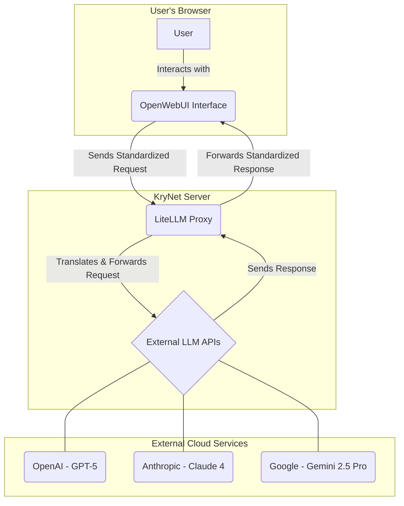

<br/><p align="center"><h1 align="center">KryNet Homelab: A Self-Hosted Private Cloud</h1><p align="center">    This repository documents the architecture and services of my personal home server, built on a repurposed gaming PC to create a private, powerful, and versatile cloud environment.
  </p>
</p>

---

## 📖 Table of Contents

- [Project Philosophy](#-project-philosophy)
- [Hardware Specifications](#-hardware-specifications)
- [Storage Architecture](#-storage-architecture)
- [Software & Services](#-software--services)
  - [Core Infrastructure](#core-infrastructure)
  - [Media Stack (The ARRs)](#media-stack-the-arrs)
    - [Media Automation Workflow](#media-automation-workflow)
  - [Photo Management](#photo-management)
  - [AI & LLM Playground](#ai--llm-playground)
    - [AI Aggregation Architecture](#ai-aggregation-architecture)
  - [Monitoring & Utilities](#monitoring--utilities)
- [Networking Overview](#-networking-overview)
  - [Domain & Access Strategy](#domain--access-strategy)
  - [Request Flow](#request-flow)
- [Future Plans & Roadmap](#-future-plans--roadmap)
- [Acknowledgements](#-acknowledgements)
- [License](#-license)

## 🎯 Project Philosophy

The goal of this project was to achieve digital sovereignty by self-hosting critical services, moving away from reliance on big tech ecosystems. The core principles are:

- **Data Ownership:** Keeping personal data (especially photos and documents) on local, owned hardware.
- **Learning & Skill Development:** Using the project as a practical opportunity to learn about system administration, containerization, networking, and ZFS.
- **Cost-Effectiveness:** Repurposing an old gaming PC to build a powerful server without significant new investment.

---

## 🖥️ Hardware Specifications

The server is built from my previous gaming rig, which provides a solid balance of performance and power efficiency for a 24/7 server.

| Component         | Model                               | Notes                                          |
| ----------------- | ----------------------------------- | ---------------------------------------------- |
| **CPU** | Intel i5-7600k                      | Solid performance for multiple Docker containers |
| **Motherboard** | Gigabyte GA-B250M-D2V               |                                                |
| **RAM** | 32GB (2x 16GB) Crucial 2400MHz DDR4 | Plenty of memory for ZFS and applications      |
| **GPU** | Zotac Geforce GTX 1060 3GB          | Used for hardware transcoding in Jellyfin       |
| **Power Supply** | Corsair VS550                       |                                                |
| **OS Drive** | 500GB Crucial SATA SSD              | For the TrueNAS Scale operating system         |

---

## 🗄️ Storage Architecture

The system runs **TrueNAS Scale** as its base operating system, leveraging the power and data integrity of the ZFS filesystem. The storage is organized into three distinct ZFS pools:

| Pool Name     | Drives                       | ZFS Config | Size (Usable) | Primary Purpose                                                              |
| :------------ | :--------------------------- | :--------- | :------------ | :--------------------------------------------------------------------------- |
| **`andromeda`** | 2x 4TB WD Red Plus           | `Mirror`   | ~4 TB         | 📸 **Photos & Videos:** The primary, resilient storage for the Immich library. |
| **`orion`** | 2x 2TB WD Blue               | `Mirror`   | ~2 TB         | 📚 **Media & App Configs:** Resilient storage for the media library and all persistent Docker container data. |
| **`comet`** | 1x 1TB WD Blue               | `Stripe`   | ~1 TB         | 📂 **General / Scratch:** A non-redundant pool for temporary files and less critical data. |

---

## ⚙️ Software & Services

All applications are deployed as Docker containers, managed through the **Portainer** web interface.

### Core Infrastructure

| Service               | Purpose                                                                                             |
| --------------------- | --------------------------------------------------------------------------------------------------- |
| **TrueNAS Scale** | The hyperconverged OS providing the ZFS storage foundation and KVM/Docker virtualization.            |
| **Portainer** | A web UI for simplified Docker container and stack management.                                        |
| **Nginx Proxy Manager** | Manages internal traffic, provides reverse proxy capabilities, and handles SSL certificate generation. |
| **Cloudflared** | Creates a secure outbound tunnel to the Cloudflare network for exposing select services without opening ports. |
| **Tailscale** | A zero-config mesh VPN for secure, encrypted access to the home network from any device, anywhere.      |
| **Gluetun** | A VPN client container that provides a secure internet gateway for other containers (e.g., download clients). |

### Media Stack (The ARRs)

| Service        | Purpose                                                                                | Access URLs (`service.mydomain.com`) |
| :------------- | :------------------------------------------------------------------------------------- | :----------------------------------- |
| **Jellyfin** | Media server for streaming movies, TV shows, and music.                                  | `media.*`                            |
| **Jellyseers** | A user-friendly interface for discovering and requesting new media.                      | `request.*`                          |
| **Sonarr** | Automates the monitoring, downloading, and organization of TV shows.                     | `sonarr.local.*`, `sonarr.tail.*`      |
| **Radarr** | Automates the monitoring, downloading, and organization of movies.                       | `radarr.local.*`, `radarr.tail.*`      |
| **Bazarr** | Companion app for Sonarr/Radarr that manages and downloads subtitles.                    | `bazarr.local.*`, `bazarr.tail.*`      |
| **Prowlarr** | Manages indexer configurations for the entire \*Arr stack.                               | `indexer.local.*`, `indexer.tail.*`    |
| **qBittorrent**| Torrent client for downloading media. Runs behind the Gluetun VPN container.             | `downloads.local.*`, `downloads.tail.*`|
| **Sabnzbd** | Usenet (NZB) client for downloading media. Runs behind the Gluetun VPN container.        | `sabnzbd.local.*`, `sabnzbd.tail.*`    |

#### Media Automation Workflow

The media stack is designed to be a fully automated, "zero-touch" system. From the moment a user requests a new movie or TV show, a chain of services works together to find, download, sort, and present it for viewing.

Here is the step-by-step data flow:

1.  **Request:** A user browses for content on the **Jellyseers** web interface and submits a request.
2.  **Dispatch:** Jellyseers intelligently sends the approved request to either **Sonarr** (for TV shows) or **Radarr** (for movies).
3.  **Search:** Sonarr/Radarr queries the configured indexers (managed centrally by **Prowlarr**) for the requested content.
4.  **Grab:** Once a suitable release is found, Prowlarr sends the `.torrent` or `.nzb` file to the appropriate download client (**qBittorrent** or **Sabnzbd**).
5.  **Secure Download:** The download client, running within the **Gluetun** VPN container, securely downloads the content. This masks the server's public IP address.
6.  **Import & Organize:** Sonarr/Radarr monitor the download client. Upon completion, they automatically move the file from the temporary download directory to the permanent media library on the `orion` pool, renaming it to a clean, standardized format.
7.  **Subtitles:** **Bazarr** detects the new file in the library, scans it, and downloads matching subtitles in the desired languages.
8.  **Library Update:** **Jellyfin** detects the new, organized file in the media library, scans its metadata and artwork, and makes it available for streaming across all client devices.

This entire process is visualized below:

````mermaid
graph TD
    subgraph "User Interaction"
        A[User] -->|Requests Media| B(Jellyseers);
    end

    subgraph "Automation & Management"
        B -->|Sends Request| C{Sonarr / Radarr};
        C -->|Searches Indexers via| D(Prowlarr);
        C -->|Monitors & Imports Files| G[Media Library on 'orion' Pool];
        H(Bazarr) -->|Scans for Subtitles| G;
    end

    subgraph "Download & Security"
        D -->|Sends to Download Client| E{qBittorrent / Sabnzbd};
        E -->|Downloads Content| F[Temporary Download Folder];
        subgraph Gluetun VPN Container
            E
        end
    end

    subgraph "Playback"
        I(Jellyfin) -->|Scans & Serves Media| G;
        J[User's TV / Phone] -->|Streams from| I;
    end

    F -- Imported by Sonarr/Radarr --> G` 

````
### Photo Management

| Service | Purpose | Access URLs (`service.mydomain.com`) |
| --- | --- | --- |
| **Immich** | A self-hosted Google Photos alternative for backing up and viewing photos/videos. | `photos.*` |

Export to Sheets

### AI & LLM Playground

| Service | Purpose | Access URLs (`service.mydomain.com`) |
| --- | --- | --- |
| **OpenWebUI** | A user-friendly, ChatGPT-like web interface for interacting with various Large Language Models. | `owui.*` |
| **LiteLLM** | A proxy that standardizes API calls to various LLMs (Claude, OpenAI, Gemini), used as a backend for OpenWebUI. | `litellm.local.*`, `litellm.tail.*` |

Export to Sheets

### AI Aggregation Architecture

The AI stack is designed to provide a single, unified interface to interact with multiple Large Language Models (LLMs) without being locked into a single provider. This is achieved by using LiteLLM as a proxy and translation layer.

The architecture decouples the user-facing application from the backend API services:

1. **Frontend Interface:** The user interacts with **OpenWebUI**. This application provides the chat interface, session history, document management (for RAG), and model selection dropdown. It is responsible for the user experience.
2. **Standardized API Call:** When a user sends a prompt, OpenWebUI does not connect directly to OpenAI or Google. Instead, it sends the request to its configured backend endpoint, which is the **LiteLLM** container.
3. **Proxy & Translation Layer:** LiteLLM acts as a brilliant "universal adapter." It receives the standardized request from OpenWebUI and consults its own configuration to determine which final LLM provider to use (e.g., "gpt-4o" should go to OpenAI, "claude-3-opus" to Anthropic).
4. **API Key Management:** LiteLLM securely stores the API keys for all the different services. It translates the incoming request into the specific format required by the target provider's API, attaches the correct API key, and forwards it.
5. **Response Handling:** The external LLM provider sends the response back to LiteLLM, which then standardizes it and passes it back to OpenWebUI for display to the user.

This setup means I can add, update, or switch LLM providers just by changing the LiteLLM config, without ever needing to restart or reconfigure OpenWebUI.

This flow is visualized below:

Code snippet



### Monitoring & Utilities

| Service | Purpose | Access URLs (`service.mydomain.com`) |
| --- | --- | --- |
| **Homarr** | A clean, modern, and customizable dashboard to provide a single pane of glass for all services. | `dash.*` |
| **UptimeKuma** | A simple and beautiful monitoring tool that checks the status of all services and sends alerts. | `monitor.*` |
| **Dozzle** | A real-time log viewer for Docker containers with a simple and clean web interface. | `logs.*` |
| **Prometheus** | A powerful time-series database for collecting and storing system and application metrics. | `prometheus.local.*`, `prometheus.tail.*` |
| **Goaccess** | Real-time web log analyzer for monitoring Nginx Proxy Manager traffic. | `npmlogs.local.*`, `npmlogs.tail.*` |

Export to Sheets

---

## 🌐 Networking Overview

The network is architected for security and flexibility, providing three distinct methods of access.

### Domain & Access Strategy

A fictional domain (`mydomain.com`) is used for this public documentation. The setup uses wildcard SSL certificates from Let's Encrypt, managed by Nginx Proxy Manager via Cloudflare's DNS challenge.

- **`.local.mydomain.com` (Local Access):** For devices connected to the home LAN. The DNS resolves locally, and traffic is routed directly to Nginx Proxy Manager.
- **`.tail.mydomain.com` (VPN Access):** For secure remote access. When connected to the Tailscale VPN, these domains resolve to the server's private Tailscale IP, routing traffic through an encrypted tunnel.
- **`service.mydomain.com` (Public Access):** For a very limited set of services, a Cloudflare Tunnel securely exposes the service to the internet. This is further protected by **Cloudflare Access**, which requires Google OAuth authentication before the request ever reaches the server.

### Request Flow

> Local User → service.local.mydomain.com → Router → Nginx Proxy Manager → Service Container
> 
> 
> **Remote User → `service.tail.mydomain.com` → Tailscale VPN → Nginx Proxy Manager → Service Container**
> 
> **Public User → `service.mydomain.com` → Cloudflare DNS/Proxy → [Cloudflare Auth] → Cloudflared Tunnel → Nginx Proxy Manager → Service Container**
> 

---

## 🗺️ Future Plans & Roadmap

This project is continuously evolving. The next planned additions are:

- [ ]  **Home Assistant:** Integrate and automate smart home devices into a central, private hub.
- [ ]  **AdGuard Home:** Deploy network-wide ad and tracker blocking at the DNS level.
- [ ]  **Implement 3-2-1 Backup Strategy:** Configure TrueNAS Cloud Sync to push encrypted, versioned backups of the `andromeda` (photos) and `orion` (app-configs) pools to a Backblaze B2 bucket.
- [ ]  **Deploy Grafana:** Create advanced, custom dashboards for Prometheus metrics.

---

## 🙏 Acknowledgements

This project would not have been possible without the incredible open-source community and the wealth of knowledge shared by content creators and users on platforms like:

- [r/homelab](https://www.reddit.com/r/homelab/)
- [r/selfhosted](https://www.reddit.com/r/selfhosted/)
- Various YouTube channels dedicated to self-hosting.

---

## 📜 License

This documentation is for informational purposes. If any configuration files are added to this repository in the future, they will be made available under the [MIT License](https://www.google.com/search?q=LICENSE).
