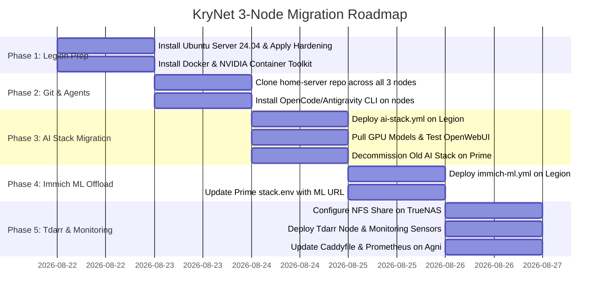

# 🌌 KryNet 3-Node Architecture Redesign & Agentic Infrastructure Blueprint

**Distributed Private Cloud | Heterogeneous 3-Node Cluster | Unified AI Agent Fleet**  
**Nodes:** 🔥 Agni (`192.168.0.200`) | 🌟 Prime (`192.168.0.100`) | ⚡ Legion (`192.168.0.150`)  
**Last Updated:** August 2026

---

## 📋 Table of Contents

1. [Executive Summary & Architectural Vision](#1-executive-summary--architectural-vision)
2. [Fleet Hardware Specifications & Node Roles](#2-fleet-hardware-specifications--node-roles)
3. [Cluster Topology & Inter-Node Synergies](#3-cluster-topology--inter-node-synergies)
4. [Legion Laptop-Server: OS & Hardware Hardening](#4-legion-laptop-server-os--hardware-hardening)
5. [Cross-Node Git & AI Agent Infrastructure (OpenCode / Antigravity)](#5-cross-node-git--ai-agent-infrastructure)
6. [Service Allocation & Docker Stack Blueprints](#6-service-allocation--docker-stack-blueprints)
7. [Network, Ingress & Split-Horizon DNS Integration](#7-network-ingress--split-horizon-dns-integration)
8. [Step-by-Step Zero-Data-Loss Migration Roadmap](#8-step-by-step-zero-data-loss-migration-roadmap)
9. [Operational Verification & Maintenance Playbook](#9-operational-verification--maintenance-playbook)

---

## 1. Executive Summary & Architectural Vision

The return of **Legion** (Lenovo Legion Gaming Laptop: Intel i7-12700H 14C/20T, 16GB RAM, NVIDIA RTX 3060 6GB, 1TB NVMe) transforms KryNet from a 2-node dual-server setup into a **specialized, 3-tier distributed private cloud**:

```
┌──────────────────────────────────────────────────────────────────────────────────┐
│                             KRYNET 3-TIER TOPOLOGY                               │
├──────────────────────────┬──────────────────────────┬────────────────────────────┤
│  🔥 AGNI (Network Core)  │  🌟 PRIME (Storage Vault)│  ⚡ LEGION (Compute Power) │
│  • Always-On Gateway     │  • ZFS Data Integrity    │  • High-Throughput CUDA    │
│  • Zero-Trust Ingress    │  • 6TB Mirrored Pools    │  • 14-Core Multi-Threading │
│  • Master Observability  │  • Media & *Arr Pipeline │  • Local LLMs & ML Offload │
│  • Identity & Smart Home │  • Persistent Databases  │  • Transcode & OCR Workers │
└──────────────────────────┴──────────────────────────┴────────────────────────────┘
```

### Core Design Principles
* **Zero Data Loss & State Isolation:** TrueNAS SCALE on Prime retains 100% of all persistent ZFS data pools (`orion` and `andromeda`), databases, and configurations. Legion is a high-speed compute engine that acts on data via high-speed APIs or NFS mounts.
* **WAF & Unshakeable Network Resilience:** Agni remains the dedicated low-power (15W) gateway. Reboots, AI benchmarks, or GPU crashes on Legion or Prime will never take down home DNS, internet access, VPN connectivity, or password management.
* **Decoupled Machine Learning & Transcoding:** Heavy AI tasks (Immich Face Recognition/CLIP search) and batch media transcoding (Tdarr NVENC) are offloaded from Prime's modest CPU/GPU to Legion's RTX 3060 and 20-thread CPU.
* **Unified GitOps & Agentic Management:** Every node runs Git repository synchronization and terminal AI agents (OpenCode / Antigravity CLI) hooked into a centralized **LiteLLM Gateway** and shared `AGENTS.md` system instructions.

---

## 2. Fleet Hardware Specifications & Node Roles

| Attribute | 🔥 Agni (Network Core) | 🌟 Prime (Storage Hub) | ⚡ Legion (Compute Engine) |
| :--- | :--- | :--- | :--- |
| **Chassis** | SkullSaints Agni Mini PC | MSI Tower Cabinet | Lenovo Legion Gaming Laptop |
| **CPU** | Intel N150 (4C/4T, Low-Power) | Intel i5-7600K (4C/4T @ 3.8GHz) | Intel i7-12700H (14C/20T: 6P + 8E) |
| **RAM** | 16GB DDR5 | 32GB DDR4 (Crucial 2400MHz) | 16GB DDR5 (High-Speed NVMe swap) |
| **GPU** | Intel UHD Graphics (iGPU) | NVIDIA GTX 1060 3GB | NVIDIA GeForce RTX 3060 6GB |
| **Storage** | 512GB NVMe SSD | 500GB SATA SSD (OS)<br>+ 2×2TB WD Blue (`orion`)<br>+ 2×4TB WD Red Plus (`andromeda`) | 1TB NVMe SSD (High IOPS) |
| **Operating System** | Ubuntu Server 24.04 LTS | TrueNAS SCALE (Dragonfish 24.10) | **Ubuntu Server 24.04 LTS (Headless)** |
| **Static LAN IP** | `192.168.0.200` | `192.168.0.100` | `192.168.0.150` |
| **Power Profile** | ~12–15W idle (Always on) | ~45–70W (Storage / ZFS Spin) | ~25–115W (Dynamic load / Boost) |
| **Primary Workloads** | Ingress, DNS, Auth, Monitoring | Storage, Databases, Media, *Arr | AI LLMs, Immich ML, Transcode, OCR |

---

## 3. Cluster Topology & Inter-Node Synergies

```mermaid
flowchart TD
    subgraph Internet
        CF[Cloudflare Tunnel]
        TS[Tailscale Mesh VPN]
        Clients[Family Mobile & Web Clients]
    end

    subgraph Agni["🔥 Agni (192.168.0.200) - Network Core"]
        Caddy["Caddy Reverse Proxy (:80/:443)"]
        AdGuard1["AdGuard Home (Primary DNS :53)"]
        Sync["AdGuard Sync (Origin)"]
        Vault["Vaultwarden (:8222)"]
        HA["Home Assistant (:8123)"]
        Prom["Prometheus Master DB (:9090)"]
        Grafana["Grafana (:3000) & Gatus (:3001)"]
        PortainerServer["Portainer Server (:9443)"]
    end

    subgraph Prime["🌟 Prime (192.168.0.100) - TrueNAS Storage Hub"]
        ZFS["ZFS Pools (orion 2TB / andromeda 4TB)"]
        ImmichCore["Immich Core Server + Postgres + Redis (:2283)"]
        Jellyfin["Jellyfin Media Server (:8096)"]
        MediaStack["*Arr Suite + Gluetun (qBittorrent/SABnzbd)"]
        TdarrServer["Tdarr Server (:8265/:8266)"]
        AdGuard2["AdGuard Home (Secondary DNS :53)"]
        Paperless["Paperless-ngx + FreshRSS"]
        NFS["NFS Export (/mnt/orion/data)"]
    end

    subgraph Legion["⚡ Legion (192.168.0.150) - AI & Compute Hub"]
        Ollama["Ollama on CUDA (RTX 3060 6GB :11434)"]
        LiteLLM["LiteLLM Unified Gateway (:4000)"]
        OpenWebUI["OpenWebUI Interface (:3999)"]
        ImmichML["Immich ML Node (CUDA Offload :3003)"]
        TdarrNode["Tdarr Transcode Node (NVENC Worker)"]
        AgentRunner["OpenCode / Antigravity Agent Runtime"]
    end

    Clients -->|Direct LAN / Split DNS| Caddy
    CF --> Caddy
    TS --> Agni

    Caddy -->|Proxy photos.krynet.cc| ImmichCore
    Caddy -->|Proxy ow.krynet.cc| OpenWebUI
    Caddy -->|Proxy litellm.krynet.cc| LiteLLM
    Caddy -->|Proxy media.krynet.cc| Jellyfin
    Caddy -->|Proxy server.krynet.cc| Prime

    Sync -->|Sync DNS rules| AdGuard2
    ImmichCore -->|ML Inference API HTTP :3003| ImmichML
    TdarrNode -->|Worker Queue :8266| TdarrServer
    TdarrNode -->|Read/Write Transcodes| NFS

    Prom -->|Scrape Metrics :9100/:8087| Agni
    Prom -->|Scrape Metrics :9100/:8087| Prime
    Prom -->|Scrape Metrics :9100/:8087| Legion
```



### Detailed Synergy Breakdown

#### 1. Immich Split-Architecture (Zero Storage Overhead, 10x ML Speed)
* **On Prime:** Holds the photo library in `/mnt/andromeda/apps/immich`, runs PostgreSQL (`pgvecto-rs`), Redis, and `immich-server`.
* **On Legion:** Runs standalone `immich-machine-learning` with CUDA on port `3003`.
* **Configuration:** Prime's `stack.env` sets `IMMICH_MACHINE_LEARNING_URL=http://192.168.0.150:3003`. Prime stops its local ML container, releasing ~4GB RAM and eliminating CPU thrashing during photo ingestion.

#### 2. Distributed Tdarr GPU Video Transcoding
* **On Prime:** `tdarr-server` tracks transcode progress, manages queues, and exposes the library at `/mnt/orion/data`. Prime creates an NFS share for `/mnt/orion/data`.
* **On Legion:** `tdarr-node` mounts `/mnt/orion/data` to `/mnt/prime-media` via high-speed NFS and utilizes its 6GB RTX 3060 (Ampere NVENC) to batch transcode 4K/1080p media at 8x–15x realtime with zero impact on Prime.

#### 3. Sovereign AI & Unified Agent Backend
* **On Legion:** Ollama runs GPU-accelerated local models (`llama3.1:8b`, `deepseek-r1:7b`, `qwen2.5-coder:7b`). LiteLLM unifies local models and cloud providers (Claude 4.6, GPT-5, Gemini 3.1) behind an OpenAI-compatible API on `http://192.168.0.150:4000/v1`.
* **Cross-Fleet Agent Access:** All three nodes (Agni, Prime, Legion) connect to LiteLLM to run terminal coding agents (OpenCode, Antigravity CLI).

---

## 4. Legion Laptop-Server: OS & Hardware Hardening

### 4.1 Recommended Operating System
**Ubuntu Server 24.04 LTS (64-bit Minimal, Headless)**

* **Why Headless?** Eliminates display server/compositor memory usage, keeping all 16GB RAM and all 6GB VRAM exclusively for Docker, CUDA, and LLM inference.
* **Why 24.04 LTS?** Kernel 6.8+ provides native Intel 12th Gen Thread Director support (optimally scheduling background tasks to E-cores and heavy ML/AI tasks to P-cores).

---

### 4.2 Laptop Server Hardening Steps

#### Step 1: Prevent Sleep on Lid Close
Ensure the laptop operates continuously with the lid closed:
```bash
sudo nano /etc/systemd/logind.conf
```
Add or modify the following lines:
```ini
[Login]
HandleLidSwitch=ignore
HandleLidSwitchExternalPower=ignore
HandleLidSwitchDocked=ignore
LidSwitchIgnoreInhibited=no
```
Restart `systemd-logind`:
```bash
sudo systemctl restart systemd-logind
```

#### Step 2: Battery Conservation Mode (Prevents Battery Degradation)
Running plugged in 24/7 at 100% capacity damages laptop lithium batteries. Enable Lenovo Conservation Mode (caps charge at ~60%):
```bash
# Test manual activation
echo 1 | sudo tee /sys/bus/platform/drivers/ideapad_acpi/VPC2004:00/conservation_mode

# Create persistent systemd service for boot
sudo tee /etc/systemd/system/battery-conservation.service << 'EOF'
[Unit]
Description=Enable Lenovo Battery Conservation Mode
After=multi-user.target

[Service]
Type=oneshot
ExecStart=/bin/sh -c 'echo 1 > /sys/bus/platform/drivers/ideapad_acpi/VPC2004:00/conservation_mode || true'
RemainAfterExit=yes

[Install]
WantedBy=multi-user.target
EOF

sudo systemctl daemon-reload
sudo systemctl enable --now battery-conservation.service
```

#### Step 3: Install NVIDIA Drivers & Container Toolkit
```bash
# 1. Install Headless Server Driver
sudo apt update && sudo apt install -y ubuntu-drivers-common
sudo ubuntu-drivers install --gpgpu

# 2. Install NVIDIA Container Toolkit
curl -fsSL https://nvidia.github.io/libnvidia-container/gpgkey | sudo gpg --dearmor -o /usr/share/keyrings/nvidia-container-toolkit-keyring.gpg
curl -s -L https://nvidia.github.io/libnvidia-container/stable/deb/nvidia-container-toolkit.list | \
  sed 's#deb https://#deb [signed-by=/usr/share/keyrings/nvidia-container-toolkit-keyring.gpg] https://#g' | \
  sudo tee /etc/apt/sources.list.d/nvidia-container-toolkit.list
sudo apt update && sudo apt install -y nvidia-container-toolkit

# 3. Configure Docker Daemon for NVIDIA
sudo nvidia-ctk runtime configure --runtime=docker
sudo systemctl restart docker

# 4. Enable GPU Persistence Mode (Instant container GPU response)
sudo tee /etc/systemd/system/nvidia-persistenced.service << 'EOF'
[Unit]
Description=NVIDIA Persistence Daemon
After=network.target

[Service]
Type=forking
ExecStart=/usr/bin/nvidia-smi -pm 1

[Install]
WantedBy=multi-user.target
EOF

sudo systemctl daemon-reload
sudo systemctl enable --now nvidia-persistenced.service
```

#### Step 4: Thermals, Airflow & Power Limits
* **Physical Elevation:** Elevate the laptop rear by 1 inch using laptop feet/stand to maintain unobstructed cool air intake underneath.
* **Keep Lid Propped Slightly:** Leaving the lid open by ~1–2 inches allows passive heat dissipation through the keyboard surface.

---

## 5. Cross-Node Git & AI Agent Infrastructure

To manage all three servers seamlessly, every server maintains a synchronized clone of the `home-server` Git repository and is equipped with AI coding agents (OpenCode / Antigravity CLI) linked to our centralized LiteLLM gateway.

```
┌──────────────────────────────────────────────────────────────────────────────────┐
│                         CROSS-NODE AGENT ARCHITECTURE                            │
└──────────────────────────────────────────────────────────────────────────────────┘
                                      │
              ┌───────────────────────┼───────────────────────┐
              │                       │                       │
       ╔══════▼══════╗         ╔══════▼══════╗         ╔══════▼══════╗
       ║   🔥 AGNI   ║         ║  🌟 PRIME   ║         ║  ⚡ LEGION  ║
       ║  Node Agent ║         ║  Node Agent ║         ║  Node Agent ║
       ╚══════╦══════╝         ╚══════╦══════╝         ╚══════╦══════╝
              │                       │                       │
              │  OpenCode / Antigravity CLI on each node      │
              └───────────────────────┬───────────────────────┘
                                      │
                                      ▼
                        ╔═══════════════════════════╗
                        ║   LITELLM API GATEWAY     ║
                        ║   192.168.0.150:4000/v1   ║
                        ╚═════════════╦═════════════╝
                                      │
                   ┌──────────────────┴──────────────────┐
                   ▼                                     ▼
         ┌───────────────────┐                 ┌───────────────────┐
         │ Local GPU Models  │                 │ Cloud API Models  │
         │ (Ollama on CUDA)  │                 │ (LiteLLM Proxied) │
         │ • qwen2.5-coder   │                 │ • Claude Opus 4.6 │
         │ • deepseek-r1     │                 │ • GPT-5.3 / 5.2   │
         │ • llama3.1:8b     │                 │ • Gemini 3.1 Pro  │
         └───────────────────┘                 └───────────────────┘
```

### 5.1 Git Repository Synchronization Across Fleet

Every node maintains a local working copy of `home-server`:

| Server | Repository Path | User / Permissions |
| :--- | :--- | :--- |
| **🔥 Agni** | `/home/agni/home-server` | `agni:agni` (UID 1000) |
| **🌟 Prime** | `/mnt/orion/apps-config/home-server` | `apps:apps` (UID 568) |
| **⚡ Legion** | `/home/legion/home-server` | `legion:legion` (UID 1000) |

#### Git Setup on All Nodes
```bash
# Clone repository using SSH key or personal access token
git clone https://github.com/yourusername/home-server.git
cd home-server

# Set up automated pull script or alias
echo "alias homerepull='cd ~/home-server && git pull --rebase'" >> ~/.bashrc
```

---

### 5.2 Agent Tooling: OpenCode & Antigravity CLI Setup

Install the coding agent CLI across all three nodes:

#### Installing OpenCode CLI / Antigravity CLI:
```bash
# Install OpenCode CLI via npm / curl:
curl -fsSL https://opencode.ai/install.sh | bash
# Or if using Antigravity CLI:
curl -fsSL https://antigravity.dev/install.sh | bash
```

#### Configuring Agent Endpoint (`~/.opencode/config.json` or `~/.gemini/config.json`)
Configure each node's agent to utilize the LiteLLM gateway hosted on Legion:

```json
{
  "api_providers": {
    "litellm_gateway": {
      "base_url": "http://192.168.0.150:4000/v1",
      "api_key": "sk-krynet-master-agent-key"
    }
  },
  "default_model": "litellm_gateway/gemini-3-flash",
  "fast_model": "litellm_gateway/qwen2.5-coder",
  "reasoning_model": "litellm_gateway/claude-opus-4.6"
}
```

#### Cost-Effective & Free Model Routing Strategy:
* **Terminal & Automation Tasks:** Use `gemini-3-flash` (free tier via Google AI Studio) or local `qwen2.5-coder:7b` (zero cost, runs on Legion's RTX 3060).
* **Complex Refactoring / Architecture:** Route to `claude-opus-4.6` or `claude-sonnet-4.5` via LiteLLM.

---

### 5.3 Global Repository System Context (`AGENTS.md`)

Create an `AGENTS.md` file at the root of the repository so any agent launched on any server immediately possesses full contextual awareness of the cluster:

```markdown
# 🤖 KryNet AI Agent Context & Operating Guidelines

## Cluster Fleet Topology
- 🔥 Agni (192.168.0.200): Network core, Caddy reverse proxy, DNS (AdGuard Primary), Monitoring (Prometheus/Grafana).
- 🌟 Prime (192.168.0.100): TrueNAS SCALE, ZFS pools (orion, andromeda), Immich DB, Media stack, Jellyfin.
- ⚡ Legion (192.168.0.150): AI stack (Ollama/LiteLLM/OpenWebUI), Immich ML offload (:3003), Tdarr worker node.

## Safety & Modification Rules
1. NEVER delete or format files in `/mnt/orion` or `/mnt/andromeda` on Prime.
2. NEVER modify `.env` or `stack.env` files containing raw secrets without backup.
3. When adding/editing a reverse proxy route, edit `config/caddy/Caddyfile` and test with `docker exec caddy caddy validate --config /etc/caddy/Caddyfile`.
4. Always pin Docker container versions where appropriate and preserve network definitions (`kry_net`, `agni_net`, `traefik_proxy`).
```

---

## 6. Service Allocation & Docker Stack Blueprints

### 6.1 Directory Structure on Legion
```
/home/legion/
├── apps/
│   └── docker/
│       ├── .env
│       ├── stack.env
│       ├── ai-stack.yml
│       ├── immich-ml.yml
│       ├── tdarr-node.yml
│       ├── monitoring-sensors.yml
│       ├── litellm/
│       │   └── config.yaml
│       └── ollama/
└── home-server/                # Git repository
```

---

### 6.2 Legion AI Stack Blueprint (`stacks/legion/ai-stack.yml`)

```yaml
services:
  # --- Local LLM Inference Engine (GPU Accelerated) ---
  ollama:
    image: ollama/ollama:latest
    container_name: ollama
    restart: unless-stopped
    ports:
      - "11434:11434"
    volumes:
      - /home/legion/apps/docker/ollama:/root/.ollama
    environment:
      - OLLAMA_KEEP_ALIVE=24h
      - NVIDIA_VISIBLE_DEVICES=all
      - NVIDIA_DRIVER_CAPABILITIES=compute,utility
    deploy:
      resources:
        reservations:
          devices:
            - driver: nvidia
              count: 1
              capabilities: [gpu]
    networks:
      - legion_net

  # --- Unified LLM Gateway & Cloud API Proxy ---
  litellm:
    image: ghcr.io/berriai/litellm:main-latest
    container_name: litellm
    restart: unless-stopped
    ports:
      - "4000:4000"
    volumes:
      - /home/legion/apps/docker/litellm/config.yaml:/app/config.yaml
    environment:
      - LITELLM_MASTER_KEY=${LITELLM_MASTER_KEY}
      - LITELLM_SALT_KEY=${LITELLM_SALT_KEY}
      - ANTHROPIC_API_KEY=${ANTHROPIC_API_KEY}
      - OPENAI_API_KEY=${OPENAI_API_KEY}
      - GEMINI_API_KEY=${GEMINI_API_KEY}
    command: ["--config", "/app/config.yaml", "--port", "4000", "--num_workers", "4"]
    depends_on:
      - ollama
    networks:
      - legion_net

  # --- ChatGPT-Style Chat Interface ---
  openwebui:
    image: ghcr.io/open-webui/open-webui:main
    container_name: openwebui
    restart: unless-stopped
    ports:
      - "3999:8080"
    volumes:
      - /home/legion/apps/docker/openwebui:/app/backend/data
    environment:
      - OLLAMA_BASE_URL=http://ollama:11434
      - OPENAI_API_BASE_URL=http://litellm:4000/v1
      - OPENAI_API_KEY=${LITELLM_MASTER_KEY}
      - WEBUI_AUTH=true
      - ENABLE_SIGNUP=false
    depends_on:
      - litellm
      - ollama
    networks:
      - legion_net

networks:
  legion_net:
    name: legion_net
    external: true
```

---

### 6.3 Legion Immich ML Offload Blueprint (`stacks/legion/immich-ml.yml`)

```yaml
services:
  immich-machine-learning:
    container_name: immich_machine_learning
    image: ghcr.io/immich-app/immich-machine-learning:release-cuda
    restart: unless-stopped
    ports:
      - "3003:3003"
    volumes:
      - /home/legion/apps/docker/immich-ml-cache:/cache
    environment:
      - NODE_ENV=production
      - MACHINE_LEARNING__FACE_RECOGNITION_MODEL=mobile_face
      - MACHINE_LEARNING__FACE_DETECTION_MODEL=yunet
      - MACHINE_LEARNING__CLIP_MODEL=ViT-B-16__laion2b_s34b_b88k
      - MACHINE_LEARNING_WORKERS=2
    deploy:
      resources:
        reservations:
          devices:
            - driver: nvidia
              count: 1
              capabilities: [gpu]
    networks:
      - legion_net

networks:
  legion_net:
    external: true
```

---

### 6.4 Legion Tdarr Transcode Node Blueprint (`stacks/legion/tdarr-node.yml`)

```yaml
services:
  tdarr-node-legion:
    image: ghcr.io/haveagitgat/tdarr_node:latest
    container_name: tdarr-node-legion
    restart: unless-stopped
    environment:
      - PUID=1000
      - PGID=1000
      - TZ=Asia/Kolkata
      - nodeID=LegionNode-RTX3060
      - nodeName=LegionNode-RTX3060
      - serverIP=192.168.0.100
      - serverPort=8266
      - NVIDIA_DRIVER_CAPABILITIES=all
      - NVIDIA_VISIBLE_DEVICES=all
    volumes:
      - /home/legion/apps/docker/tdarr/configs:/app/configs
      - /home/legion/apps/docker/tdarr/logs:/app/logs
      - /mnt/prime-media:/data           # NFS mount from Prime's /mnt/orion/data
      - /home/legion/apps/docker/tdarr/temp:/temp # High-speed local NVMe transcode cache
    deploy:
      resources:
        reservations:
          devices:
            - driver: nvidia
              count: 1
              capabilities: [gpu]
    networks:
      - legion_net

networks:
  legion_net:
    external: true
```

---

### 6.5 Legion Monitoring Sensors (`stacks/legion/monitoring-sensors.yml`)

```yaml
services:
  # --- Portainer Agent (Controlled from Agni) ---
  portainer-agent:
    image: portainer/agent:2.21.5
    container_name: portainer_agent
    restart: unless-stopped
    ports:
      - "9001:9001"
    volumes:
      - /var/run/docker.sock:/var/run/docker.sock
      - /var/lib/docker/volumes:/var/lib/docker/volumes
    networks:
      - legion_net

  # --- Node Exporter (Host Metrics) ---
  node-exporter:
    image: prom/node-exporter:latest
    container_name: node_exporter_legion
    restart: unless-stopped
    ports:
      - "9100:9100"
    command:
      - '--path.procfs=/host/proc'
      - '--path.sysfs=/host/sys'
      - '--path.rootfs=/rootfs'
    volumes:
      - /proc:/host/proc:ro
      - /sys:/host/sys:ro
      - /:/rootfs:ro
    networks:
      - legion_net

  # --- cAdvisor (Container Metrics) ---
  cadvisor:
    image: gcr.io/cadvisor/cadvisor:latest
    container_name: cadvisor_legion
    restart: unless-stopped
    ports:
      - "8087:8080"
    volumes:
      - /:/rootfs:ro
      - /var/run:/var/run:ro
      - /sys:/sys:ro
      - /var/lib/docker/:/var/lib/docker:ro
    networks:
      - legion_net

  # --- Dozzle (Log Viewer) ---
  dozzle:
    image: amir20/dozzle:latest
    container_name: dozzle_legion
    restart: unless-stopped
    ports:
      - "8088:8080"
    volumes:
      - /var/run/docker.sock:/var/run/docker.sock
    networks:
      - legion_net

  # --- Tailscale Mesh Node ---
  tailscale:
    image: tailscale/tailscale:latest
    container_name: tailscale-legion
    restart: unless-stopped
    network_mode: host
    cap_add:
      - NET_ADMIN
      - NET_RAW
    volumes:
      - /home/legion/apps/docker/tailscale:/var/lib/tailscale
      - /dev/net/tun:/dev/net/tun
    environment:
      - TS_AUTHKEY=${TS_AUTHKEY}
      - TS_HOSTNAME=legion-server
      - TS_STATE_DIR=/var/lib/tailscale
      - TS_EXTRA_ARGS=--reset

networks:
  legion_net:
    external: true
```

---

## 7. Network, Ingress & Split-Horizon DNS Integration

### 7.1 Caddy Routing on Agni (`config/caddy/Caddyfile`)

Update Caddy reverse proxy on Agni to map AI and compute hostnames to Legion (`192.168.0.150`):

```caddyfile
# =========================================================
#  Legion (AI, GPU & Compute Hub - Remote 192.168.0.150)
# =========================================================

# OpenWebUI Interface
@ow host ow.krynet.cc ow.lan.kkasbi.in
handle @ow {
    reverse_proxy http://192.168.0.150:3999
}

# LiteLLM Unified Gateway
@litellm host litellm.krynet.cc litellm.lan.kkasbi.in
handle @litellm {
    reverse_proxy http://192.168.0.150:4000
}

# Ollama API
@ollama host ollama.krynet.cc ollama.lan.kkasbi.in
handle @ollama {
    reverse_proxy http://192.168.0.150:11434
}

# Dozzle Logs (Legion)
@dozzle3 host logs3.krynet.cc logs3.lan.kkasbi.in
handle @dozzle3 {
    reverse_proxy http://192.168.0.150:8088
}
```

### 7.2 Prometheus Scrape Targets on Agni (`config/prometheus/prometheus.yml`)
Add Legion scrape targets so Grafana and Prometheus track all three servers:
```yaml
scrape_configs:
  - job_name: 'node-exporter'
    static_configs:
      - targets: ['127.0.0.1:9100']
        labels: { instance: 'agni' }
      - targets: ['192.168.0.100:9100']
        labels: { instance: 'prime' }
      - targets: ['192.168.0.150:9100']
        labels: { instance: 'legion' }

  - job_name: 'cadvisor'
    static_configs:
      - targets: ['127.0.0.1:8087']
        labels: { instance: 'agni' }
      - targets: ['192.168.0.100:8087']
        labels: { instance: 'prime' }
      - targets: ['192.168.0.150:8087']
        labels: { instance: 'legion' }
```

---

## 8. Step-by-Step Zero-Data-Loss Migration Roadmap



### Phase 1: Legion Setup & Hardware Hardening
1. Install **Ubuntu Server 24.04 LTS Headless** on Legion's 1TB NVMe.
2. Set static IP `192.168.0.150` via router DHCP reservation or `/etc/netplan/`.
3. Apply lid switch ignore and battery conservation mode (60% threshold).
4. Install NVIDIA server drivers and NVIDIA Container Toolkit. Verify with `docker run --rm --gpus all nvidia/cuda:12.0.0-base-ubuntu22.04 nvidia-smi`.

### Phase 2: Clone Repo & Setup AI Agent Environment
1. On Legion: `git clone https://github.com/yourusername/home-server.git /home/legion/home-server`.
2. On Prime: verify `home-server` repo exists at `/mnt/orion/apps-config/home-server`.
3. On Agni: verify `home-server` repo exists at `/home/agni/home-server`.
4. Install OpenCode / Antigravity CLI on all three nodes.

### Phase 3: Deploy AI Stack on Legion
1. Create `stacks/legion/` directory and deploy `ai-stack.yml`.
2. Pull high-performance models on Legion's RTX 3060:
   ```bash
   docker exec -it ollama ollama pull llama3.1:8b
   docker exec -it ollama ollama pull deepseek-r1:7b
   docker exec -it ollama ollama pull qwen2.5-coder:7b
   docker exec -it ollama ollama pull nomic-embed-text
   ```
3. Stop and disable the old AI stack on Prime (`docker compose -f ai-stack.yml down`).

### Phase 4: Immich ML Offload
1. Deploy `stacks/legion/immich-ml.yml` on Legion.
2. On Prime, update `stack.env`:
   ```bash
   IMMICH_MACHINE_LEARNING_URL=http://192.168.0.150:3003
   ```
3. In Prime's `immich.yml`, comment out or stop `immich-machine-learning`.
4. Restart Immich Server on Prime (`docker restart immich_server`).
5. Open `https://photos.krynet.cc` -> **Administration** -> **Settings** -> **Machine Learning** to verify external ML connection.

### Phase 5: Tdarr Distributed Transcode Node
1. On TrueNAS (Prime), create an NFS Share for `/mnt/orion/data` allowing IP `192.168.0.150` (Maproot: apps/apps).
2. On Legion, install `nfs-common` and mount the share:
   ```bash
   sudo mkdir -p /mnt/prime-media
   echo "192.168.0.100:/mnt/orion/data /mnt/prime-media nfs defaults,noatime 0 0" | sudo tee -a /etc/fstab
   sudo mount -a
   ```
3. Deploy `stacks/legion/tdarr-node.yml` on Legion.
4. Verify on `https://tdarr.krynet.cc` that `LegionNode-RTX3060` is connected and active.

### Phase 6: Ingress, Reverse Proxy & Monitoring Updates
1. Update `config/caddy/Caddyfile` on Agni with Legion routes. Validate and reload Caddy:
   ```bash
   docker exec caddy caddy validate --config /etc/caddy/Caddyfile
   docker exec caddy caddy reload --config /etc/caddy/Caddyfile
   ```
2. Update `prometheus.yml` on Agni and restart Prometheus.
3. Link Legion's Portainer Agent (`192.168.0.150:9001`) into Agni's Portainer Master UI.

---

## 9. Operational Verification & Maintenance Playbook

### Diagnostic Commands

```bash
# 1. Check GPU utilization on Legion
nvidia-smi

# 2. Test local LLM response from terminal
curl -X POST http://192.168.0.150:11434/api/generate -d '{
  "model": "qwen2.5-coder:7b",
  "prompt": "Write a python function to check disk space",
  "stream": false
}'

# 3. Test LiteLLM Gateway health
curl http://192.168.0.150:4000/health/liveliness

# 4. Verify Immich ML API response
curl http://192.168.0.150:3003/ping

# 5. Check battery conservation status on Legion
cat /sys/bus/platform/drivers/ideapad_acpi/VPC2004:00/conservation_mode
# Should return '1'
```

### Agent Maintenance Workflows
* **Deploy a new stack from any server:**
  ```bash
  opencode "Deploy the new mealie stack on Prime under /mnt/orion/apps-config and configure Caddy route on Agni"
  ```
* **Diagnose transcode queues:**
  ```bash
  opencode "Check Tdarr transcode node errors on Legion and verify NFS mount latency to Prime"
  ```

---

**Architected with ❤️ for Maximum Resilience, Data Sovereignty, and AI Supercomputing**
